# AWS-VPC-with-Public-Private-Subnets-and-EC2-Deployment

### 1. Project Overview:
This project provisions an AWS Virtual Private Cloud (VPC) with both **public and private subnets** using Terraform. An **EC2 instance** is deployed in the public subnet and automatically configured with Nginx to serve a simple web page. The private subnet is internet-enabled through a **NAT Gateway** for secure backend services.

Note:
I will also demonstrate the equivalent AWS Console of each HCL Block to make more sense on how I build a VPC. Please take note that we will start with the Phase 1 architectural diagram to demonstrate the baby steps on how to provision a VPC with a built in security group.

### 2. Architecture Diagram
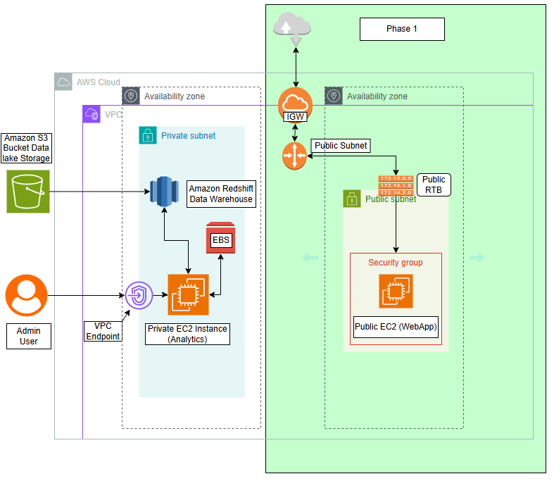

### 3. Technologies Used
**Components:**
- **Terraform** for infrastructure as code
- **VPC** (`10.0.0.0/16`)
- **Public Subnet** (`10.0.0.0/24`) → Public EC2 instance
- **Private Subnet** (`10.0.1.0/24`) → Private EC2 instance
- **Internet Gateway** for public access
- **NAT Gateway** for private subnet outbound internet
- **Security Groups** allowing HTTP(80) & SSH(22)
- **Public EC2 Instance + User Data Automation** for Output Testing

### 4. Deployment Instructions
## ⚙️ How to Deploy
```bash
# 1️⃣ Initialize Terraform
terraform init

# 2️⃣ Review the plan
terraform plan

# 3️⃣ Apply configuration
terraform apply -auto-approve

# 4️⃣ Get EC2 IP
terraform output ec2_public_ip
```

🛡 Security Notes
Restrict SSH access by editing the Security Group ingress rules.

Use your own AWS key pair name in variables.tf.

Here's my variables you can prefer later on:
```hcl
variable "project_name" {
  default = "v-portfolio"
}

variable "vpc_cidr" {
  default = "10.0.0.0/16"
}

variable "public_subnet_cidr" {
  default = "10.0.0.0/24"
}

variable "private_subnet_cidr" {
  default = "10.0.1.0/24"
}

variable "instance_type" {
  description = "Small compute resource for testing purposes only."
  default = "t3.small"
}

variable "ssh_allowed_cidr" {
  description = "CIDR block allowed to SSH"
  type = string
  default = "0.0.0.0/0"
}

variable "key_name" {
  description = "Existing AWS key pair name for SSH"
  default     = ""  # Put your own .pem file
}
```


Step #1: Create VPC
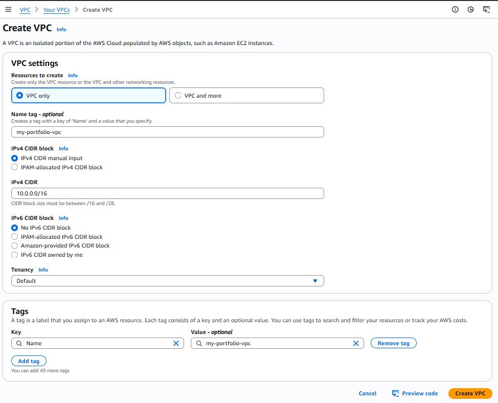

Equivalent HCL Code: 
(from VPC.tf)
```hcl
# 1. Create VPC
resource "aws_vpc" "main" {
  cidr_block = var.vpc_cidr # 10.0.0.0/16
  tags = {
    Name = "${var.project_name}-vpc" # v-portfolio-vpc
  }
}
```

Step #2: Create Public and Private Subnet
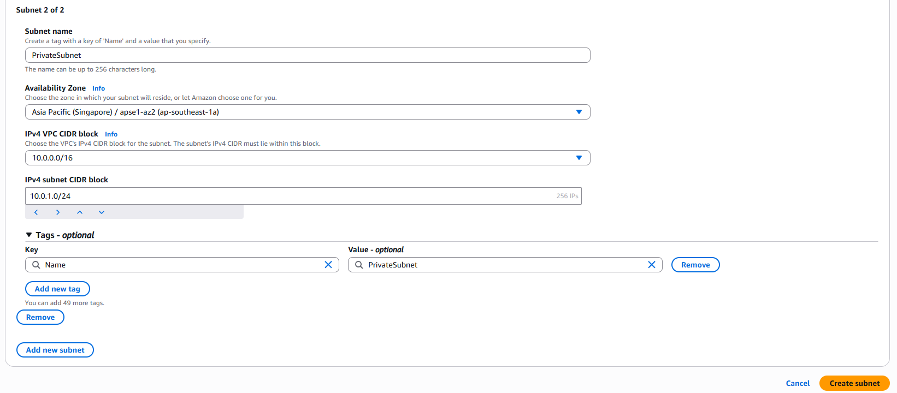

Equivalent HCL Code:
(from VPC.tf)
```hcl
# 2. Create Public and Private Subnet
resource "aws_subnet" "public" {
  vpc_id                  = aws_vpc.main.id
  cidr_block              = var.public_subnet_cidr
  map_public_ip_on_launch = true
  availability_zone       = "ap-southeast-1a" # Change as needed
  tags = {
    Name = "${var.project_name}-public-subnet"
  }
}


resource "aws_subnet" "private" {
  vpc_id            = aws_vpc.main.id
  cidr_block        = var.private_subnet_cidr
  availability_zone = "ap-southeast-1a"
  tags = {
    Name = "${var.project_name}-private-subnet"
  }
}
```

Step #3: Create Internet Gateway
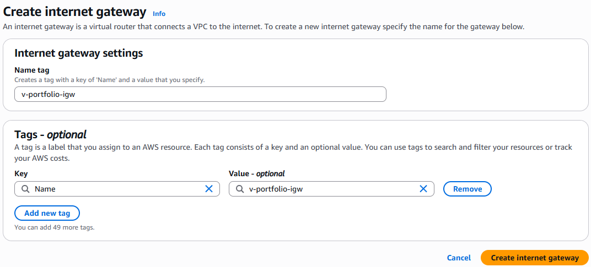

Equivalent HCL Code:
(from VPC.tf)
```hcl
# 3. Create Internet Gateway
resource "aws_internet_gateway" "igw" {
  vpc_id = aws_vpc.main.id
  tags = {
    Name = "${var.project_name}-igw"
  }
}
```

Step #4: Create Public Route Table
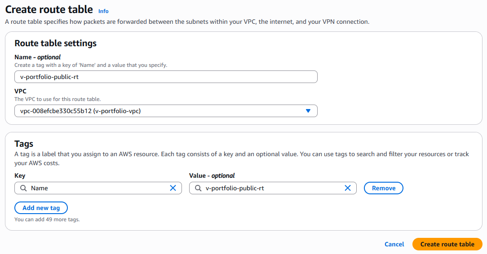

Edit subnet associate and we should associate the public subnet
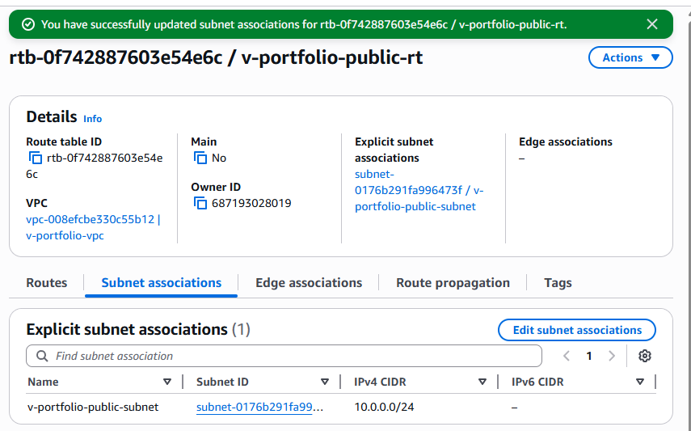

Edit route and this should include a publoc routing so we can access the virtual machine later on.
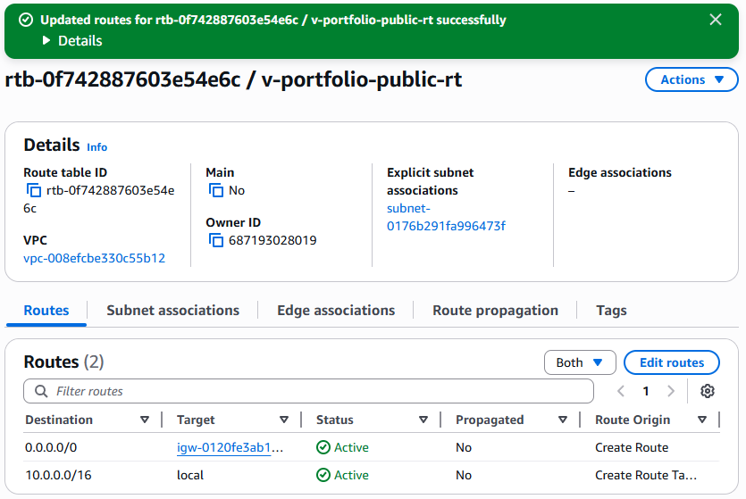

Equivalent HCL Code:
```hcl
# 4. Create Public Route Table
resource "aws_route_table" "public" {
  vpc_id = aws_vpc.main.id
  tags = {
    Name = "${var.project_name}-public-rt"
  }
}

resource "aws_route" "public_internet_access" {
  route_table_id         = aws_route_table.public.id
  destination_cidr_block = "0.0.0.0/0"
  gateway_id             = aws_internet_gateway.igw.id
}

resource "aws_route_table_association" "public_assoc" {
  subnet_id      = aws_subnet.public.id
  route_table_id = aws_route_table.public.id
}
```

Step #5: Create security groups for inbound and outbound traffic control.
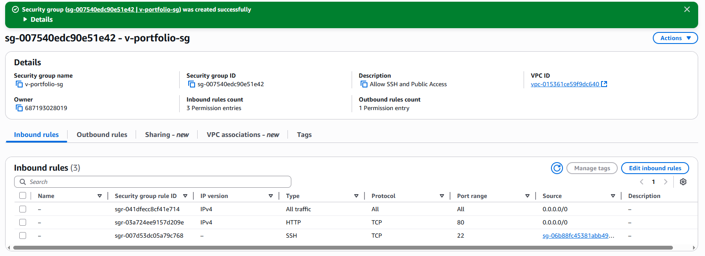

Please Take Note:
- For demo purposes SSHis open to all. In production, this should be restricted to a specific IP.

Equivalent HCL Code:
(from SecurityGroups.tf)

```hcl
# 2. Security Group
resource "aws_security_group" "web_sg" {
  vpc_id = aws_vpc.main.id
  name   = "${var.project_name}-sg"

  tags = {
    Name = "${var.project_name}-sg"
  }
}

# Updated block of code for best practice purposes
resource "aws_vpc_security_group_ingress_rule" "allow_ssh" {
  security_group_id = aws_security_group.web_sg.id
  cidr_ipv4         = aws_vpc.main.cidr_block
  from_port         = 22
  ip_protocol       = "tcp"
  to_port           = 22
}

# Ingress rule: HTTP
resource "aws_vpc_security_group_ingress_rule" "allow_http" {
  security_group_id = aws_security_group.web_sg.id
  cidr_ipv4         = "0.0.0.0/0"
  from_port         = 80
  to_port           = 80
  ip_protocol       = "tcp"
}

# Ingress rule: All traffic
resource "aws_vpc_security_group_ingress_rule" "allow_public_traffic_ipv4" {
  security_group_id = aws_security_group.web_sg.id
  cidr_ipv4         = "0.0.0.0/0"
  ip_protocol       = "-1"
}

# Egress rule: Allow all outbound
resource "aws_vpc_security_group_egress_rule" "allow_all_outbound" {
  security_group_id = aws_security_group.web_sg.id
  cidr_ipv4         = "0.0.0.0/0"
  ip_protocol       = "-1" # semantically equivalent to all ports
}
```

Final Step: Launch EC2 Public Instance

Equivalent HCL Code:
(from public_ec2.tf)

```hcl
# 1. EC2 Instance
resource "aws_instance" "web" {
  ami                    = "ami-0061376a80017c383" # Amazon Linux 2023 in ap-southeast-1
  instance_type          = var.instance_type
  subnet_id              = aws_subnet.public.id
  availability_zone = "ap-southeast-1a"
  vpc_security_group_ids = [aws_security_group.web_sg.id]
  key_name               = var.key_name
  user_data              = file("userdata.sh")

  tags = {
    Name = "${var.project_name}-ec2"
  }
}
```

Inside of userdata.sh:

```shell
#!/bin/bash
yum update -y
amazon-linux-extras enable nginx1
yum install -y nginx
systemctl start nginx
systemctl enable nginx
echo "<h1>VPC Portfolio Project Running on EC2</h1>" > /usr/share/nginx/html/index.html
```

### 5. Outputs
Finally, we can now run the terraform apply command in out shell:
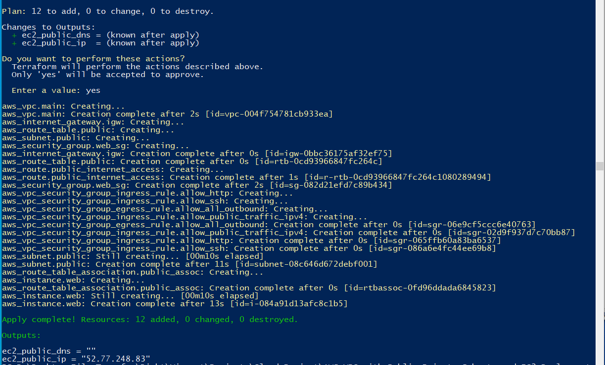

To verify if our EC2 Instance is Live,  we can access out public IP Output in any web browsser. As shown below, it is running
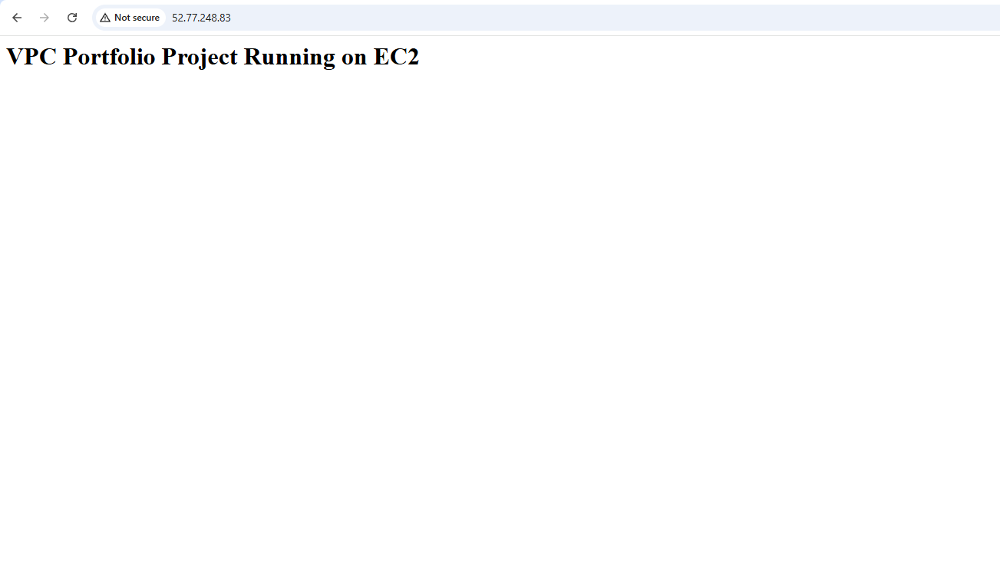


### 6. Cleanup Instructions
For our safety and to avoid unexpected charges from our AWS Accout. We sould keep in mind to use terraform destroy to terminate the resources that we recently build.
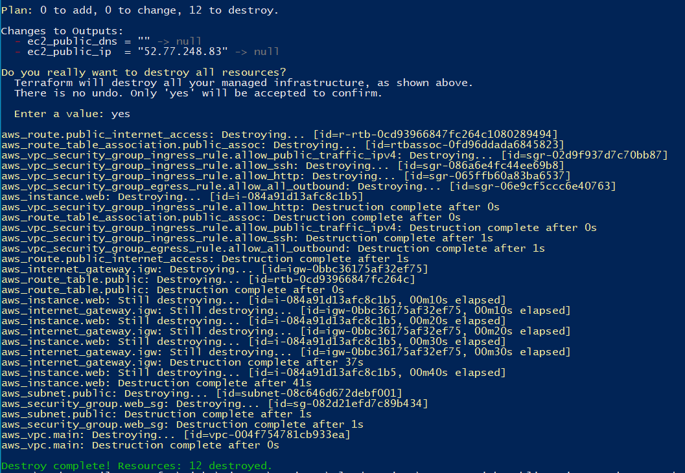

This is the end of my Phase 1 project. I hope you appreciate my step by step on building my first terraform project.

### 7. Future Improvements
For the next phase of this project. I will deploy the following:
- Add an RDS database in the private subnet.
- Use an Application Load Balancer (ALB).
- Configure Terraform remote backend (S3 + DynamoDB)
- Deploy using CI/CD (GitHub Actions or CodePipeline.)


### What I learn?
- We learn about the basic deployment of EC2 Instance with Modified VPC and Security Groups by using Infrastructure as Code platform for repeatability purpose in the future and to minimize the risk of error when we need to deploy a cloud infrastructure in the future use.