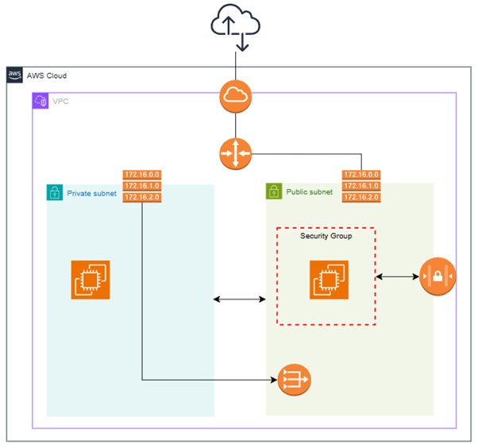

# AWS-VPC-with-Public-Private-Subnets-and-EC2-Deployment
This project provisions an AWS Virtual Private Cloud (VPC) with both **public and private subnets** using Terraform. An **EC2 instance** is deployed in the public subnet and automatically configured with Nginx to serve a simple web page. The private subnet is internet-enabled through a **NAT Gateway** for secure backend services.

Note:
I will also demonstrate the equivalent AWS Console of each HCL Block to make more sense on how I build a VPC.

# Architecture


**Components:**
- **VPC** (`10.0.0.0/16`)
- **Public Subnet** (`10.0.1.0/24`) → EC2 instance
- **Private Subnet** (`10.0.2.0/24`)
- **Internet Gateway** for public access
- **NAT Gateway** for private subnet outbound internet
- **Security Groups** allowing HTTP(80) & SSH(22)
- **Terraform** for infrastructure as code


## ⚙️ How to Deploy
```bash
# 1️⃣ Initialize Terraform
terraform init

# 2️⃣ Review the plan
terraform plan

# 3️⃣ Apply configuration
terraform apply -auto-approve

# 4️⃣ Get EC2 IP
terraform output ec2_public_ip
```

🛡 Security Notes
Restrict SSH access by editing the Security Group ingress rules.

Use your own AWS key pair name in variables.tf.

Here's my variables you can prefer later on:
```hcl
variable "project_name" {
  default = "v-portfolio"
}

variable "vpc_cidr" {
  default = "10.0.0.0/16"
}

variable "public_subnet_cidr" {
  default = "10.0.0.0/24"
}

variable "private_subnet_cidr" {
  default = "10.0.2.0/24"
}

variable "instance_type" {
  default = "t3.small"
}

variable "key_name" {
  description = "Existing AWS key pair name for SSH"
  default     = "my-key" 
}
```


Step #1: Create VPC


Equivalent HCL Code: 
(from main.tf)
```hcl
# 1. Create VPC
resource "aws_vpc" "main" {
  cidr_block = var.vpc_cidr # 10.0.0.0/16
  tags = {
    Name = "${var.project_name}-vpc" # v-portfolio-vpc
  }
}
```

Step #2: Create Public and Private Subnet


Equivalent HCL Code:
(from main.tf)
```hcl
# 2. Create Public and Private Subnet
resource "aws_subnet" "public" {
  vpc_id                  = aws_vpc.main.id
  cidr_block              = var.public_subnet_cidr
  map_public_ip_on_launch = true
  availability_zone       = "ap-southeast-1a" # Change as needed
  tags = {
    Name = "${var.project_name}-public-subnet"
  }
}


resource "aws_subnet" "private" {
  vpc_id            = aws_vpc.main.id
  cidr_block        = var.private_subnet_cidr
  availability_zone = "ap-southeast-1a"
  tags = {
    Name = "${var.project_name}-private-subnet"
  }
}
```

Step #3: Create Internet Gateway


Equivalent HCL Code:
```hcl
# 3. Create Internet Gateway
resource "aws_internet_gateway" "igw" {
  vpc_id = aws_vpc.main.id
  tags = {
    Name = "${var.project_name}-igw"
  }
}
```

Step #4: Create Public Route Table


Edit subnet associate and we should associate the public subnet


Edit route and this should include a publoc routing so we can access the virtual machine later on.


Equivalent HCL Code:
```hcl
# 4. Create Public Route Table
resource "aws_route_table" "public" {
  vpc_id = aws_vpc.main.id
  tags = {
    Name = "${var.project_name}-public-rt"
  }
}

resource "aws_route" "public_internet_access" {
  route_table_id         = aws_route_table.public.id
  destination_cidr_block = "0.0.0.0/0"
  gateway_id             = aws_internet_gateway.igw.id
}

resource "aws_route_table_association" "public_assoc" {
  subnet_id      = aws_subnet.public.id
  route_table_id = aws_route_table.public.id
}
```