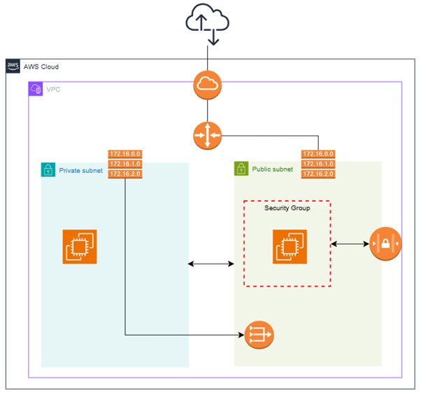
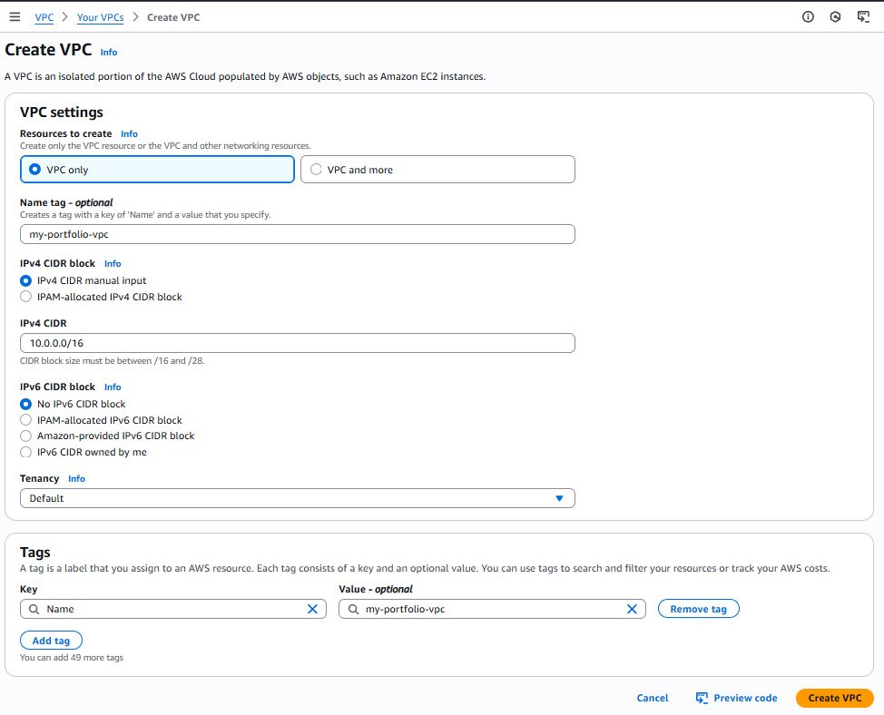

# AWS-VPS-with-Public-Private-Subnets-and-EC2-Deployment
This project provisions an AWS Virtual Private Cloud (VPC) with both **public and private subnets** using Terraform. An **EC2 instance** is deployed in the public subnet and automatically configured with Nginx to serve a simple web page. The private subnet is internet-enabled through a **NAT Gateway** for secure backend services.

Note:
I will also demonstrate the equivalent AWS Console of each HCL Block to make more sense on how I build a VPC.

# Architecture


**Components:**
- **VPC** (`10.0.0.0/16`)
- **Public Subnet** (`10.0.1.0/24`) → EC2 instance
- **Private Subnet** (`10.0.2.0/24`)
- **Internet Gateway** for public access
- **NAT Gateway** for private subnet outbound internet
- **Security Groups** allowing HTTP(80) & SSH(22)
- **Terraform** for infrastructure as code


## ⚙️ How to Deploy
```bash
# 1️⃣ Initialize Terraform
terraform init

# 2️⃣ Review the plan
terraform plan

# 3️⃣ Apply configuration
terraform apply -auto-approve

# 4️⃣ Get EC2 IP
terraform output ec2_public_ip
```

🛡 Security Notes
Restrict SSH access by editing the Security Group ingress rules.

Use your own AWS key pair name in variables.tf.


Step #1: Create VPC



